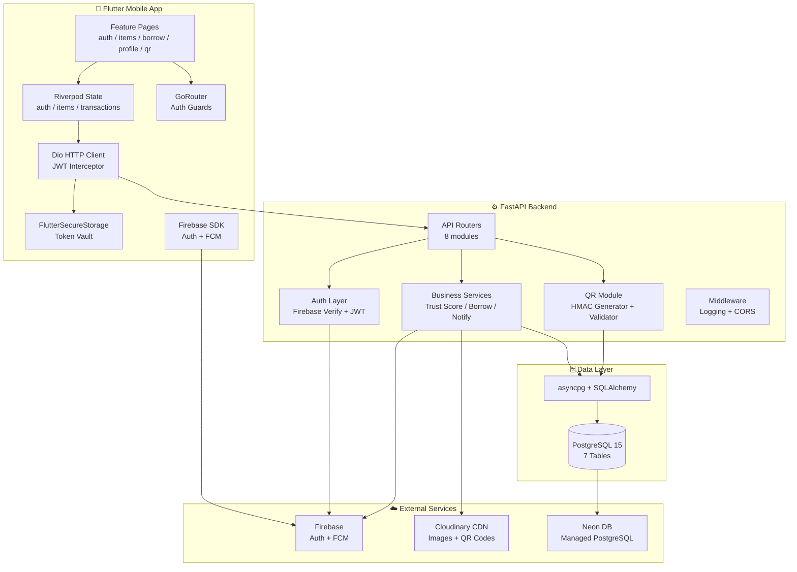

```mermaid
graph TB
    subgraph Mobile["📱 Flutter Mobile App"]
        UI[Feature Pages<br/>auth / items / borrow / profile / qr]
        State[Riverpod State<br/>auth / items / transactions]
        Router[GoRouter<br/>Auth Guards]
        DioClient[Dio HTTP Client<br/>JWT Interceptor]
        SecureStorage[FlutterSecureStorage<br/>Token Vault]
        FirebaseSDK[Firebase SDK<br/>Auth + FCM]
    end

    subgraph Backend["⚙️ FastAPI Backend"]
        Router2[API Routers<br/>8 modules]
        AuthLayer[Auth Layer<br/>Firebase Verify + JWT]
        Services[Business Services<br/>Trust Score / Borrow / Notify]
        QRModule[QR Module<br/>HMAC Generator + Validator]
        Middleware[Middleware<br/>Logging + CORS]
    end

    subgraph Data["🗄️ Data Layer"]
        PG[(PostgreSQL 15<br/>7 Tables)]
        AsyncPG[asyncpg + SQLAlchemy]
    end

    subgraph External["☁️ External Services"]
        Firebase[Firebase<br/>Auth + FCM]
        Cloudinary[Cloudinary CDN<br/>Images + QR Codes]
        Neon[Neon DB<br/>Managed PostgreSQL]
    end

    UI --> State
    UI --> Router
    State --> DioClient
    DioClient --> Router2
    DioClient --> SecureStorage
    FirebaseSDK --> Firebase

    Router2 --> AuthLayer
    Router2 --> Services
    Router2 --> QRModule
    AuthLayer --> Firebase
    Services --> AsyncPG
    Services --> Cloudinary
    Services --> Firebase
    QRModule --> AsyncPG
    AsyncPG --> PG
    PG --> Neon
```
