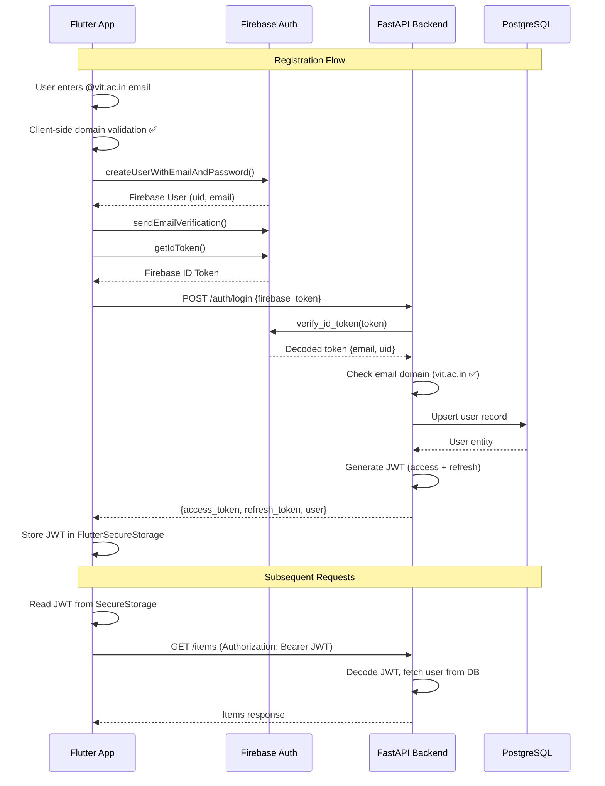

```mermaid
sequenceDiagram
    participant U as Flutter App
    participant FB as Firebase Auth
    participant API as FastAPI Backend
    participant DB as PostgreSQL

    Note over U,DB: Registration Flow
    U->>U: User enters @vit.ac.in email
    U->>U: Client-side domain validation ✅
    U->>FB: createUserWithEmailAndPassword()
    FB-->>U: Firebase User (uid, email)
    U->>FB: sendEmailVerification()
    U->>FB: getIdToken()
    FB-->>U: Firebase ID Token
    U->>API: POST /auth/login {firebase_token}
    API->>FB: verify_id_token(token)
    FB-->>API: Decoded token {email, uid}
    API->>API: Check email domain (vit.ac.in ✅)
    API->>DB: Upsert user record
    DB-->>API: User entity
    API->>API: Generate JWT (access + refresh)
    API-->>U: {access_token, refresh_token, user}
    U->>U: Store JWT in FlutterSecureStorage

    Note over U,DB: Subsequent Requests
    U->>U: Read JWT from SecureStorage
    U->>API: GET /items (Authorization: Bearer JWT)
    API->>API: Decode JWT, fetch user from DB
    API-->>U: Items response
```
