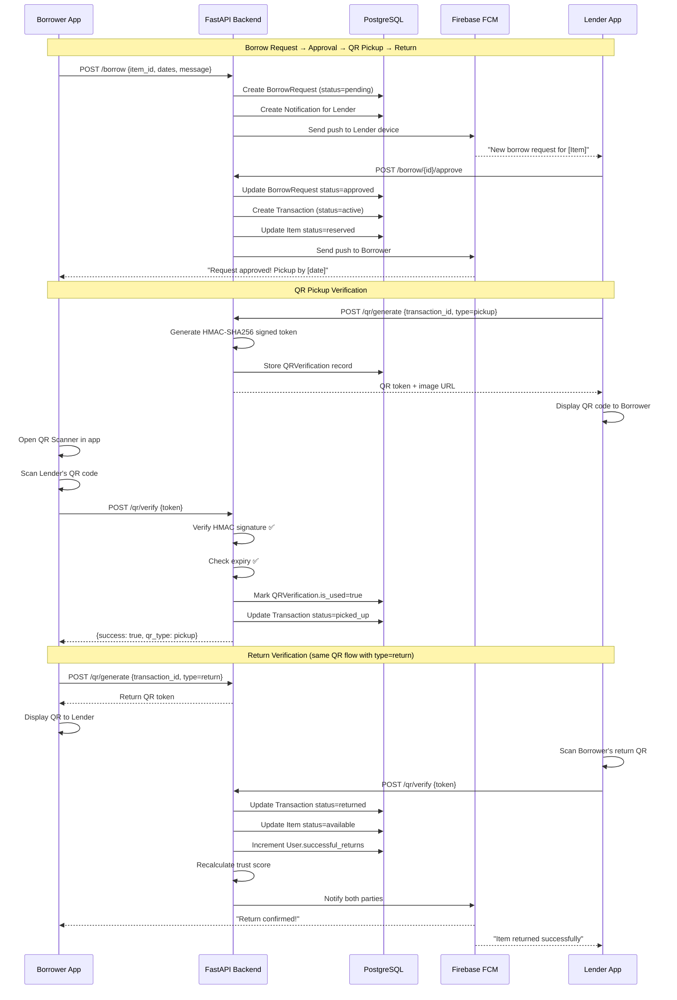

```mermaid
sequenceDiagram
    participant B as Borrower App
    participant API as FastAPI Backend
    participant DB as PostgreSQL
    participant FCM as Firebase FCM
    participant L as Lender App

    Note over B,L: Borrow Request → Approval → QR Pickup → Return

    B->>API: POST /borrow {item_id, dates, message}
    API->>DB: Create BorrowRequest (status=pending)
    API->>DB: Create Notification for Lender
    API->>FCM: Send push to Lender device
    FCM-->>L: "New borrow request for [Item]"

    L->>API: POST /borrow/{id}/approve
    API->>DB: Update BorrowRequest status=approved
    API->>DB: Create Transaction (status=active)
    API->>DB: Update Item status=reserved
    API->>FCM: Send push to Borrower
    FCM-->>B: "Request approved! Pickup by [date]"

    Note over B,L: QR Pickup Verification
    L->>API: POST /qr/generate {transaction_id, type=pickup}
    API->>API: Generate HMAC-SHA256 signed token
    API->>DB: Store QRVerification record
    API-->>L: QR token + image URL
    L->>L: Display QR code to Borrower

    B->>B: Open QR Scanner in app
    B->>B: Scan Lender's QR code
    B->>API: POST /qr/verify {token}
    API->>API: Verify HMAC signature ✅
    API->>API: Check expiry ✅
    API->>DB: Mark QRVerification.is_used=true
    API->>DB: Update Transaction status=picked_up
    API-->>B: {success: true, qr_type: pickup}

    Note over B,L: Return Verification (same QR flow with type=return)
    B->>API: POST /qr/generate {transaction_id, type=return}
    API-->>B: Return QR token
    B->>B: Display QR to Lender
    L->>L: Scan Borrower's return QR
    L->>API: POST /qr/verify {token}
    API->>DB: Update Transaction status=returned
    API->>DB: Update Item status=available
    API->>DB: Increment User.successful_returns
    API->>API: Recalculate trust score
    API->>FCM: Notify both parties
    FCM-->>B: "Return confirmed!"
    FCM-->>L: "Item returned successfully"
```
