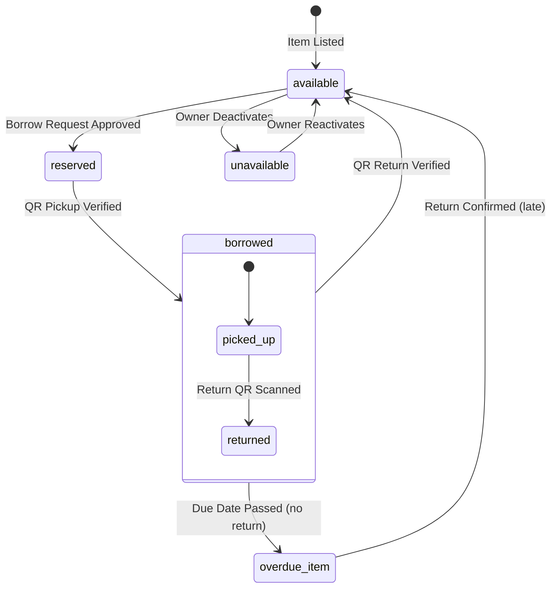
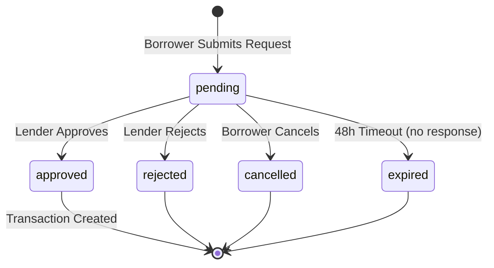
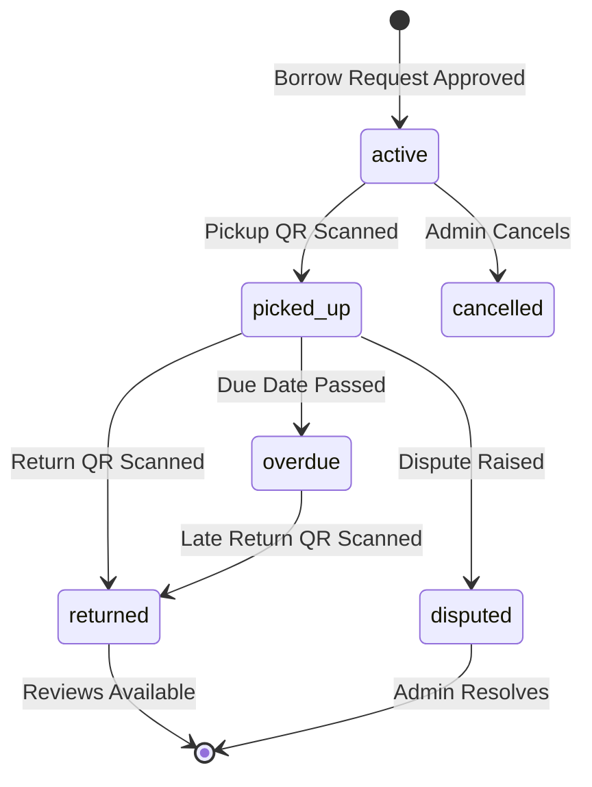

```mermaid
stateDiagram-v2
    [*] --> available : Item Listed

    available --> reserved : Borrow Request Approved
    reserved --> borrowed : QR Pickup Verified
    borrowed --> available : QR Return Verified
    borrowed --> overdue_item : Due Date Passed (no return)
    overdue_item --> available : Return Confirmed (late)

    available --> unavailable : Owner Deactivates
    unavailable --> available : Owner Reactivates

    state borrowed {
        [*] --> picked_up
        picked_up --> returned : Return QR Scanned
    }
```

```mermaid
stateDiagram-v2
    [*] --> pending : Borrower Submits Request

    pending --> approved : Lender Approves
    pending --> rejected : Lender Rejects
    pending --> cancelled : Borrower Cancels
    pending --> expired : 48h Timeout (no response)

    approved --> [*] : Transaction Created
    rejected --> [*]
    cancelled --> [*]
    expired --> [*]
```

```mermaid
stateDiagram-v2
    [*] --> active : Borrow Request Approved

    active --> picked_up : Pickup QR Scanned
    picked_up --> returned : Return QR Scanned
    picked_up --> overdue : Due Date Passed

    overdue --> returned : Late Return QR Scanned
    returned --> [*] : Reviews Available

    active --> cancelled : Admin Cancels
    picked_up --> disputed : Dispute Raised
    disputed --> [*] : Admin Resolves
```
